# LT3763 恒流电源板——老师一对一研讨版

状态：第二版大纲和Slide 13样张已于2026-08-25由用户确认。Slide 13作为全稿视觉与表达基准，进入完整页面制作阶段。

## 叙事目标

这份PPT不是“请老师立刻挑错”，也不是正式答辩。讲述顺序固定为：

1. 先让老师了解电路板的用途、接口、组成和功率路径。
2. 再由设计者说明原理图中关键参数如何计算、器件为什么这样选择。
3. 接着说明这些设计怎样落实到四层PCB和大电流回路。
4. 最后把尚未闭环的问题、判断边界和样机测试方案交给老师把关。

全稿约40页。此前48页详细审板稿继续作为独立资料册，不在主线中逐页复述。

---

# 第一部分：电路板介绍与总体方案

## Slide 1：LT3763同步降压恒流电源板
- 36V输入，29V/18A输出，额定输出功率约522W
- 当前版本：`8.13 5.epro2`
- 交流目的：介绍设计依据，并请老师对未闭环问题把关
- 角色：封面
- Required images:
  - 当前PCB整板；严格输入素材；PCB图形不得重绘

    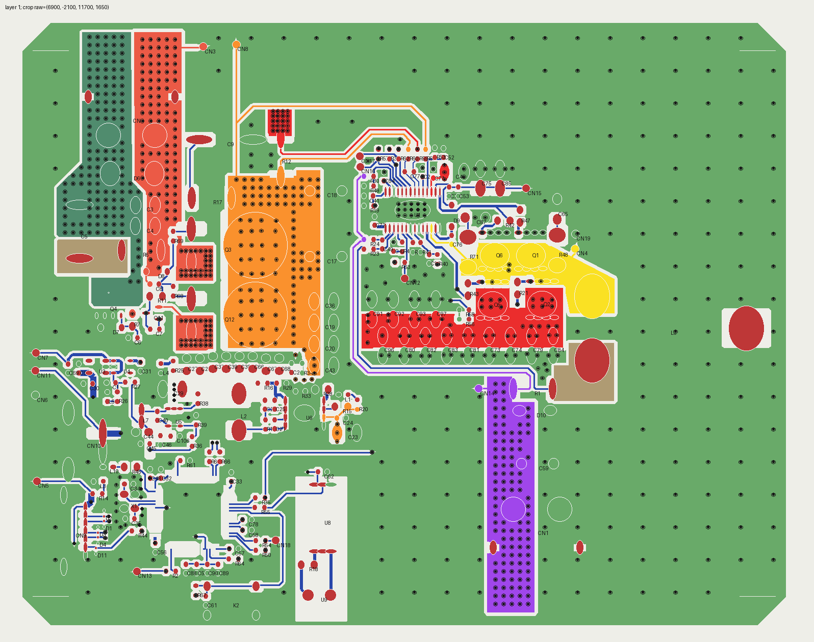

## Slide 2：本次交流的内容安排
- 第一部分：电路板用途、接口、功能模块和能量流向
- 第二部分：原理图参数计算与主要器件选择
- 第三部分：大电流PCB、开关环、采样和过孔实现
- 第四部分：未确定问题与样机验证方案
- 角色：目录 / 交流路线

## Slide 3：设计背景与负载需求
- 电源输入标称36V，目标输出29V/18A
- 输出功率约522W，属于高电流同步Buck应用
- 输出允许接近30V，不要求29V成为绝对硬上限
- 当前目标是完成首版实验板，经过分级测试后再定型
- 角色：应用背景 / 需求来源

## Slide 4：主要设计指标与工作边界
- 输入：标称36V；当前UVLO约34.0V启动、30.3V关闭
- 输出：标称约29.19V，持续工作目标18A
- 开关频率：约200kHz
- 制造：四层板，计划全部2oz；盘中孔采用树脂塞孔＋电镀盖孔
- 角色：指标总表

## Slide 5：系统组成与能量流向
- 主功率路径：输入保护→输入采样→同步半桥→电感→输出采样→负载
- 控制路径：LT3763读取输入/输出采样并驱动外置MOS
- 设定路径：MCU/DAC给出电流命令，NTC提供温度降额
- 辅助路径：LM5164产生12V，再供控制和后级使用
- 角色：系统框图

## Slide 6：外部接口与板上主要节点
- 输入端：VCC_BAT、GND
- 输出端：VCC_OUT、GND
- 主要功率节点：$1N947、SW、L6、R1、R12
- 控制与调试节点：PWM、FAULT、CTRL1、CTRL2、VC、FB、ISMON、IVINMON
- 角色：接口说明 / 为后续原理图讲解建立名词
- Required images:
  - 当前PCB整板；严格输入素材；只增加接口标记

    

## Slide 7：PCB功能分区与器件位置
- 左上：输入端、TVS、反接及过压保护
- 中上：LT3763、半桥MOS、本地输入电容与电感
- 下部：MCU、采样、通信和辅助电源
- 右侧：输出连接与外部负载区域
- 角色：实物认识 / 板上定位
- Required images:
  - 当前PCB整板；严格输入素材；允许增加半透明分区和短标签

    

## Slide 8：主功率路径与回流路径
- 正向路径：VCC_BAT→Q3/Q12→R12→$1N947→Q2/Q5→SW→L6→R1→VCC_OUT
- 低边续流路径：SW→Q1/Q6→GND
- 高频回路只集中在本地MLCC与上下桥之间
- 平均大电流路径、开关高di/dt路径和采样路径需要分别审查
- 角色：能量路径 / 进入技术细节前的总览
- Required images:
  - 顶层功率区域；严格输入素材；用于标出正向电流和回流

    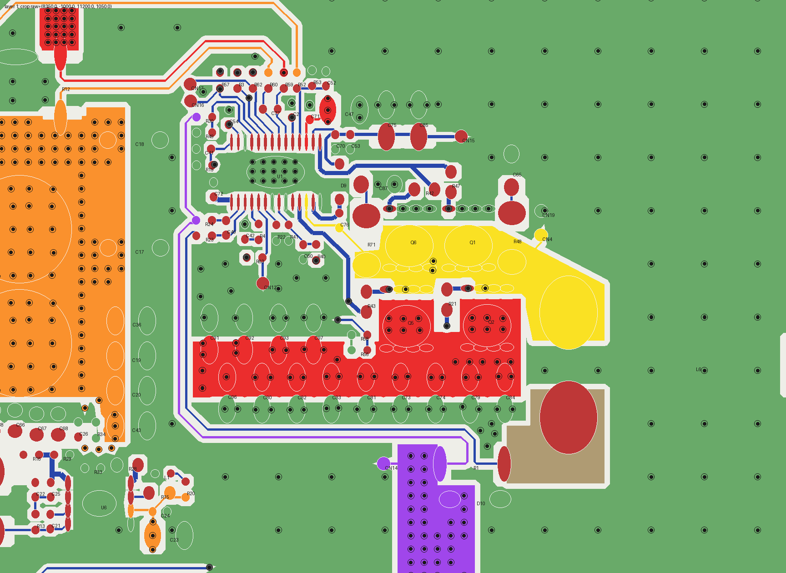

---

# 第二部分：原理图参数计算与器件选择

## Slide 9：同步Buck拓扑与LT3763的控制职责
- LT3763是同步降压控制器，主功率由外置MOS、电感和铜皮传输
- 芯片负责平均电流控制、输出电压控制、输入平均限流、栅极驱动和故障状态
- 60V是芯片绝对额定边界，不应当作为正常瞬态工作余量
- 选择LT3763的原因：高电流外置功率级、恒流/恒压、输入输出电流监测
- 角色：核心控制器选择
- Required images:
  - LT3763数据手册首页；严格输入素材；保持典型应用和器件型号不变

    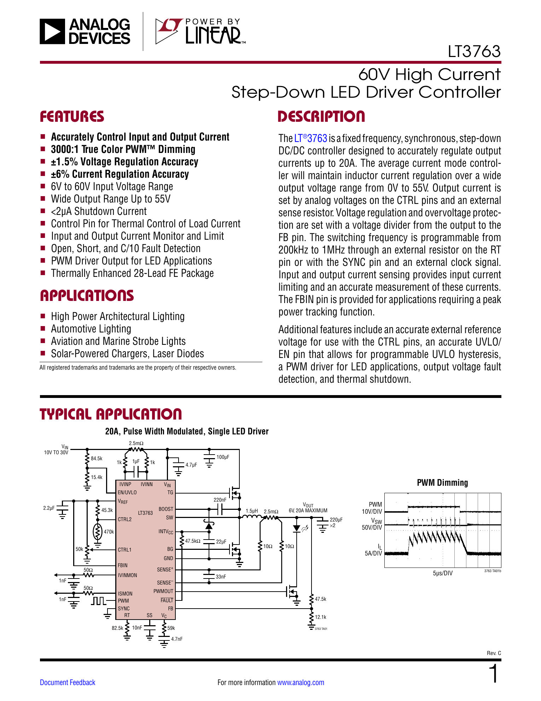

## Slide 10：LT3763内部控制环与保护路径
- 输出电流环：CTRL1/CTRL2/SS/FBIN形成允许电流参考，SENSE±完成闭环
- 输出电压环：FB调节输出，并提供内部过压锁止
- 输入电流环：IVINP/N限制并监测平均输入电流
- 驱动与时序：TG、BG、BOOST、SW及非重叠时间控制半桥
- 角色：控制原理
- Required images:
  - LT3763内部框图；严格输入素材；连线和文字不得改变

    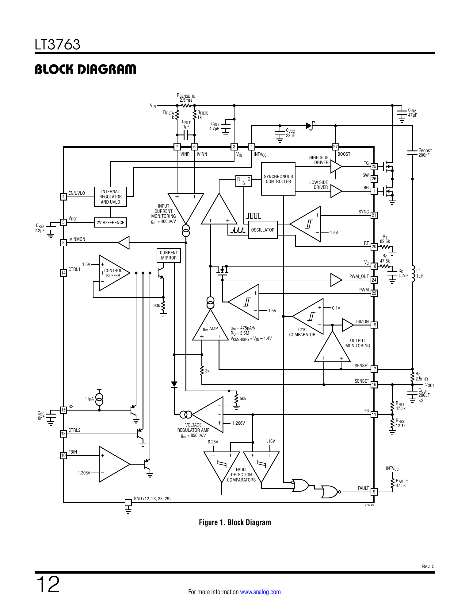

## Slide 11：29.19V输出电压的设定
- 当前反馈电阻：R30=232kΩ，R49=10kΩ
- 计算：`VOUT=1.206×(1+232/10)≈29.19V`
- 目标允许接近30V，因此当前标称值满足需求
- 需要在样机中测量反馈误差、负载调整率和线路压降
- 角色：电压设定计算
- Required images:
  - LT3763输出电压设定页面；严格输入素材

    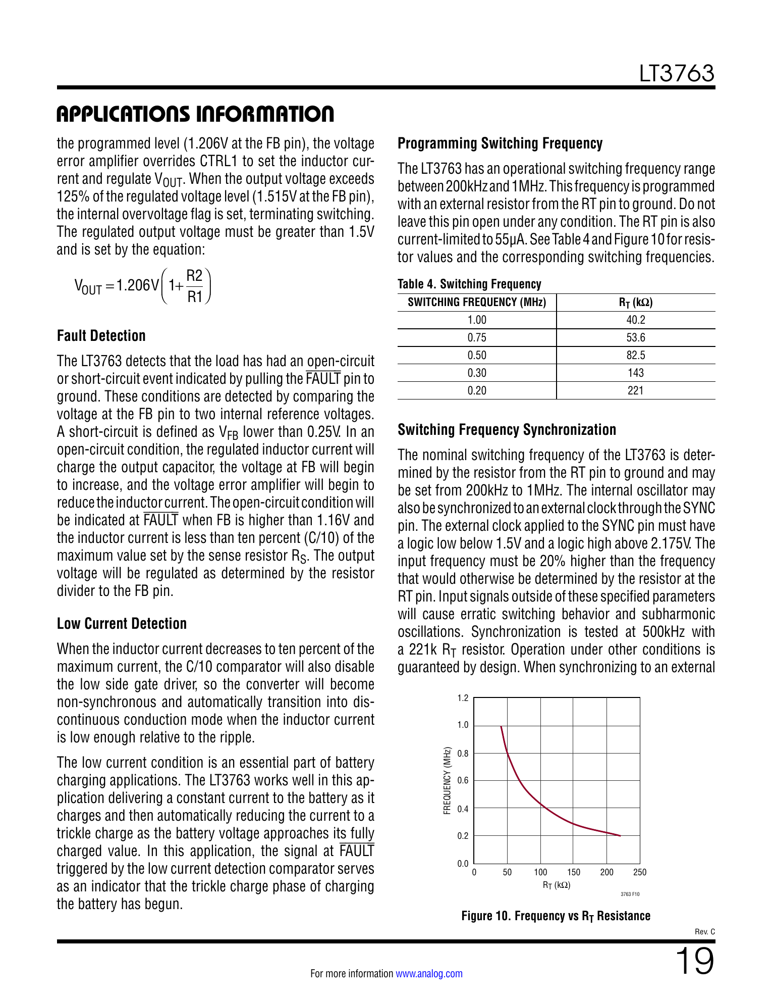

## Slide 12：输出过压阈值与29V调节值的关系
- FB正常调节基准约1.206V
- 内部过压锁止基准约1.515V
- 同一分压网络对应：`1.515×(1+232/10)≈36.66V`
- 36.66V属于内部失控保护阈值，不是正常输出上限
- 角色：过压保护计算
- Required images:
  - LT3763输出电压与OVP说明；严格输入素材

    

## Slide 13：18A输出电流设定与硬件量程
- 输出采样电阻R1=2.5mΩ
- 18A时采样压降：`18×2.5mΩ=45mV`
- LT3763典型满量程约51mV，因此典型硬件量程约20.4A
- 正常稳态由CTRL1设定18A，R1/SENSE±负责检测与闭环
- 数据手册导读：Figure 6说明CTRL1用于模拟设定电感电流；Figure 8说明SENSE差分电压与ISMON输出呈线性关系，并给出2.5mΩ对应约20A的示例
- 角色：输出电流计算
- Required images:
  - LT3763电流控制和检测曲线；严格输入素材

    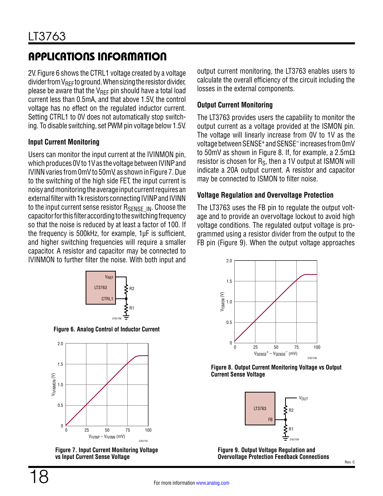

## Slide 14：MCU/DAC到CTRL1的电流命令换算
- CTRL1满量程约1.5V对应约51mV采样压降
- 18A需要45mV，对应CTRL1典型约1.32V
- DAC经过R2=10kΩ、R19=8.2kΩ分压后接入CTRL1
- 计算得到DAC约2.94V；首次上电建议从更低值逐级增加
- 角色：软硬件接口计算

## Slide 15：CTRL2温度降额网络
- R56=100k/B3950 NTC，R57=20kΩ，R58=100kΩ
- 估算允许电流：25℃约19.4A、35℃约18A、50℃约15.5A、60℃约13.6A
- CTRL2低于CTRL1时才会降低输出电流
- 降额曲线是否合理取决于NTC安装位置和实际热点温度
- 角色：温度保护计算
- Required images:
  - LT3763温度降额说明；严格输入素材

    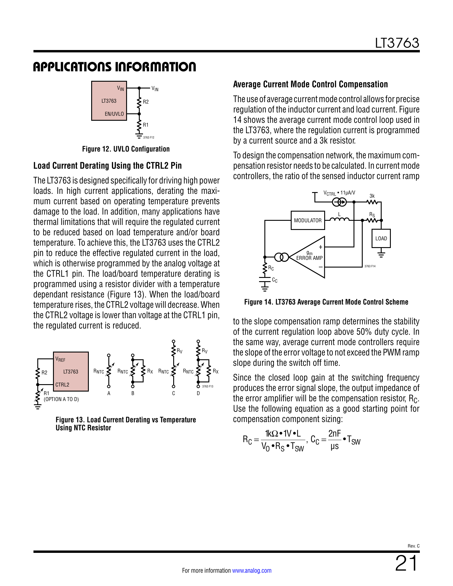

## Slide 16：EN/UVLO启动与关闭阈值
- R52=120kΩ，R53=6.34kΩ
- 当前计算结果约34.0V启动、30.3V关闭
- 该阈值适合36V稳定输入，并避免低输入时继续要求29V/18A
- 需要确认实际电池或电源最低输入范围是否与此一致
- 角色：欠压锁定计算
- Required images:
  - LT3763 UVLO说明；严格输入素材

    

## Slide 17：FBIN输入电压折返功能
- FBIN根据输入电压降低允许的输出电流，主要用于峰值功率跟踪或输入电压调节
- 当前电路需说明FBIN分压、正常36V工作点和开始折返阈值
- FBIN不是输入平均电流采样，也不是输出短路逐周期保护
- 是否需要使用该功能，应结合输入源特性确定
- 角色：输入电压调节功能

## Slide 18：R12与输入平均电流限制
- 输入采样电阻R12=2.5mΩ
- LT3763输入限流阈值45～55mV，对应约18～22A
- 36V输入、29V/18A、效率约95%时，输入平均电流约15.3A
- 36V稳定输入下余量可用；输入降到30～31V时可能先进入输入限流
- 角色：输入限流计算

## Slide 19：IVINP/N滤波网络的设计目的
- R59=1kΩ、R60=1kΩ、C77=1µF
- 该网络用于滤除高边开关造成的输入电流噪声，观察和限制平均输入电流
- 数据手册明确给出1kΩ与1µF作为500kHz示例；当前200kHz仍需结合稳定性验证
- 该慢滤波不能取代SENSE±输出电流环的快速保护
- 角色：输入采样滤波依据
- Required images:
  - LT3763输入电流监测说明；严格输入素材

    

## Slide 20：开关频率与VC补偿网络
- R22=221kΩ，对应约200kHz开关频率
- 当前补偿网络R4=18.2kΩ、C42=10nF
- 200kHz降低开关损耗，但会增加电感和输出纹波设计压力
- 补偿值只能作为计算起点，需要通过启动和负载阶跃波形确认
- 角色：频率与环路补偿
- Required images:
  - LT3763补偿与布局建议；严格输入素材

    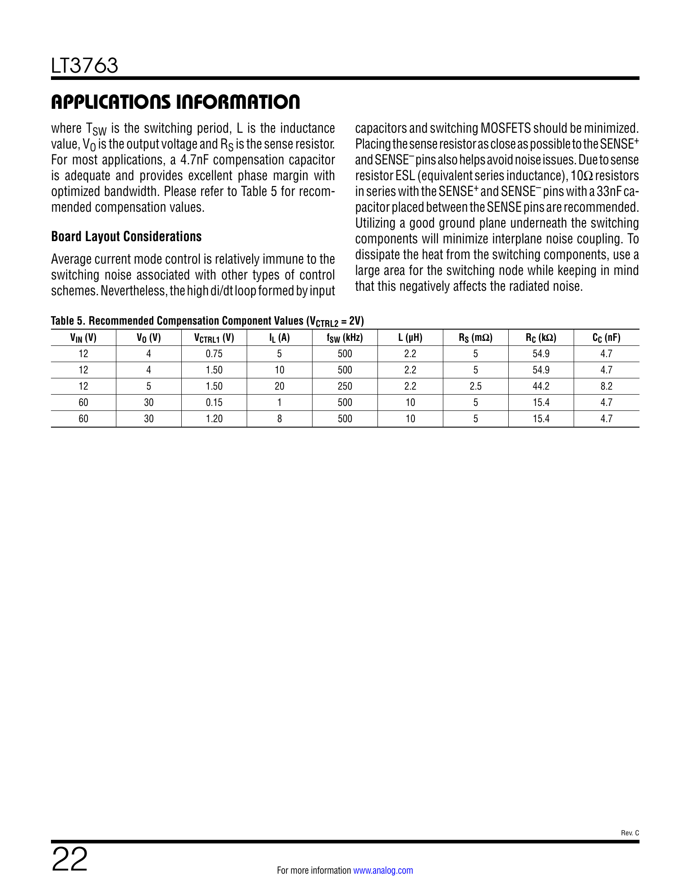

## Slide 21：INTVCC、BOOST与栅极驱动外围
- INTVCC约5V，为低边驱动和BOOST充电提供电源
- C75/C85当前为47µF；需要统一原理图、BOM与DNP状态
- D5=SS510，C76=220nF形成高边自举供电
- 自举回路、栅极分叉和源极回流必须在PCB上保持短且对称
- 角色：驱动供电选择

## Slide 22：主开关MOS BSC070N10LS5的选择
- VDS额定100V，高于36V母线并为SW尖峰保留余量
- 逻辑电平器件，适合LT3763约5V栅极驱动
- 4.5V条件下RDS(on)上限约7mΩ；总栅极电荷约16nC
- 四只MOS采用高低边各两只并联，以降低导通损耗和分散热量
- 角色：主MOS选型
- Required images:
  - BSC070N10LS5关键参数；严格输入素材

    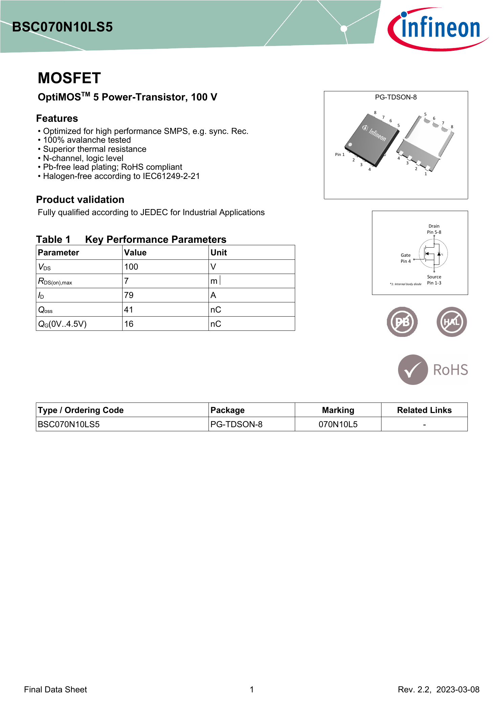

## Slide 23：并联MOS的损耗与动态风险
- 直流导通损耗可按电流分配和RDS(on)估算
- 高频开关损耗还取决于Qg、开关速度、死区、寄生电感和SW尖峰
- 并联器件静态均流较容易，动态均流主要由栅极与源极公共阻抗决定
- 必须通过四只MOS温升与TG/BG波形验证实际一致性
- 角色：MOS损耗与可靠性
- Required images:
  - BSC070动态与SOA曲线；严格输入素材

    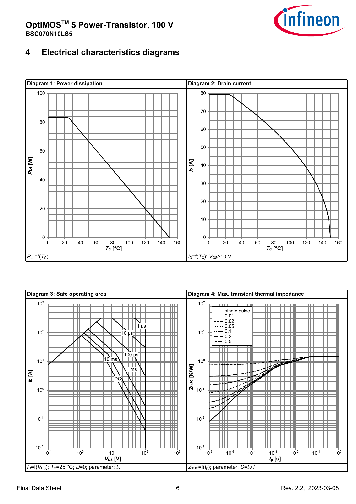

## Slide 24：L6电感值、纹波与饱和电流
- L6=6.8µH，额定电流约30A，饱和电流约40A，DCR约2mΩ
- 36V→29V、200kHz时估算电感纹波约4.15App
- 18A输出时峰值电流约20.1A，低于额定与饱和指标
- 仍需实测磁芯损耗、铜损和稳态温升
- 角色：电感选型计算

## Slide 25：R1与R12采样电阻的功耗
- R1=2.5mΩ，18A时功耗约0.81W
- R12在36V满载输入约15.3A时功耗约0.59W
- 连续功耗之外还要考虑焊盘温升、铜皮温差和脉冲承受能力
- 两只采样电阻既是功率器件，也是控制精度基准
- 角色：采样电阻热设计

## Slide 26：输入与输出电容配置
- 本地输入MLCC负责半桥高di/dt电流，不由远端大电解替代
- 已在$1N947与GND、紧贴半桥位置增加两颗10µF/100V/1210
- 输出电容需结合电感纹波、负载阶跃和电压环稳定性确定
- 需要在样机中测量输入纹波、输出纹波和电容温升
- 角色：电容选择与分工
- Required images:
  - 半桥与本地电容区域；严格输入素材

    

## Slide 27：输入保护器件与动态配合
- D6=SMCJ36CA负责输入瞬态钳位，最大钳位电压约58.1V
- Q3/Q12=SUM110P08 80V P-MOS，负责反接和过压切断
- U7=BZT52C43与R8=100kΩ构成栅极钳位/检测相关网络
- 两组0.3Ω+100µF串联RC用于吸收和阻尼输入阶跃能量
- 角色：输入保护选型
- Required images:
  - 输入保护PCB区域；严格输入素材

    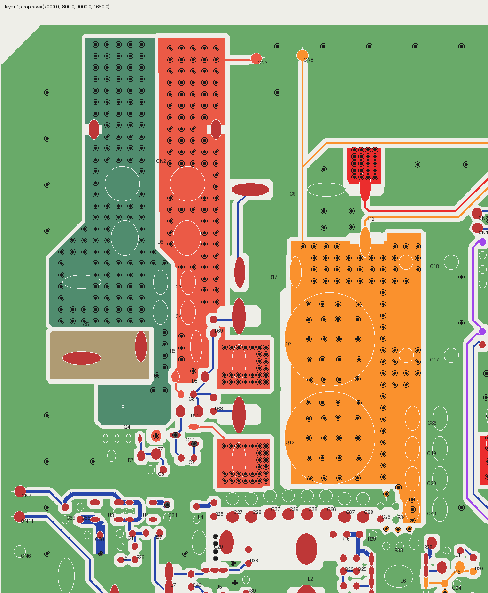
  - SUM110P08参数；严格输入素材

    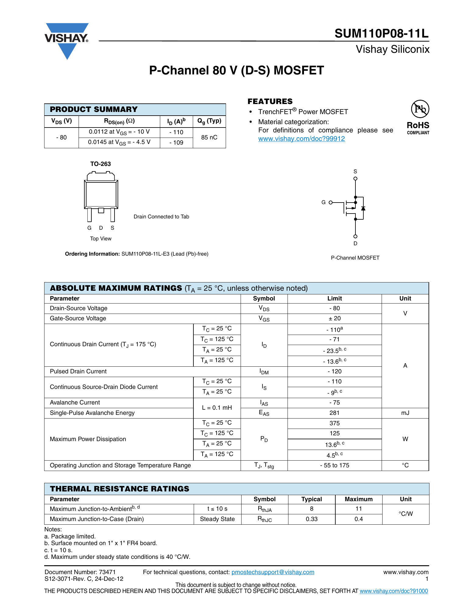
  - BZT52C43参数表；严格输入素材

    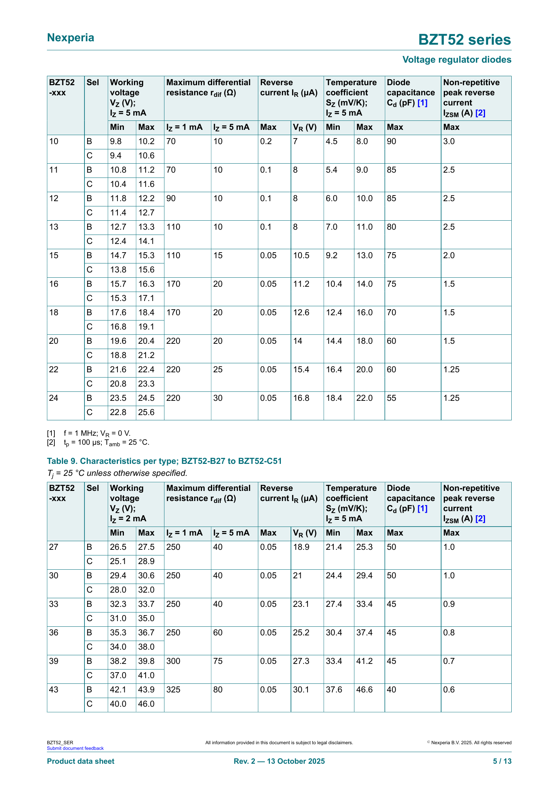

## Slide 28：输入RC阻尼支路的能量与脉冲应力
- 单支0.3Ω+100µF在理想36V阶跃下储能约64.8mJ
- 初始理论电流约120A，电阻瞬时功率约4.32kW，时间常数约30µs
- 3W连续额定不能直接证明可承受重复热插拔脉冲
- 需要查电阻脉冲曲线，并用实际线束和电源内阻验证波形
- 角色：阻尼支路计算

## Slide 29：LM5164辅助电源外围
- LM5164将36V转换为12V，为控制、驱动及后级供电
- C25当前2.2nF，需要结合数据手册和样机轻载/瞬态确定
- 辅助电源应在主Buck升功率前单独验证启动、稳态和掉电
- 辅助电源异常可能导致MCU复位、PWM/FAULT异常或驱动供电不稳
- 角色：辅助电源设计
- Required images:
  - LM5164应用与布局页面；严格输入素材

    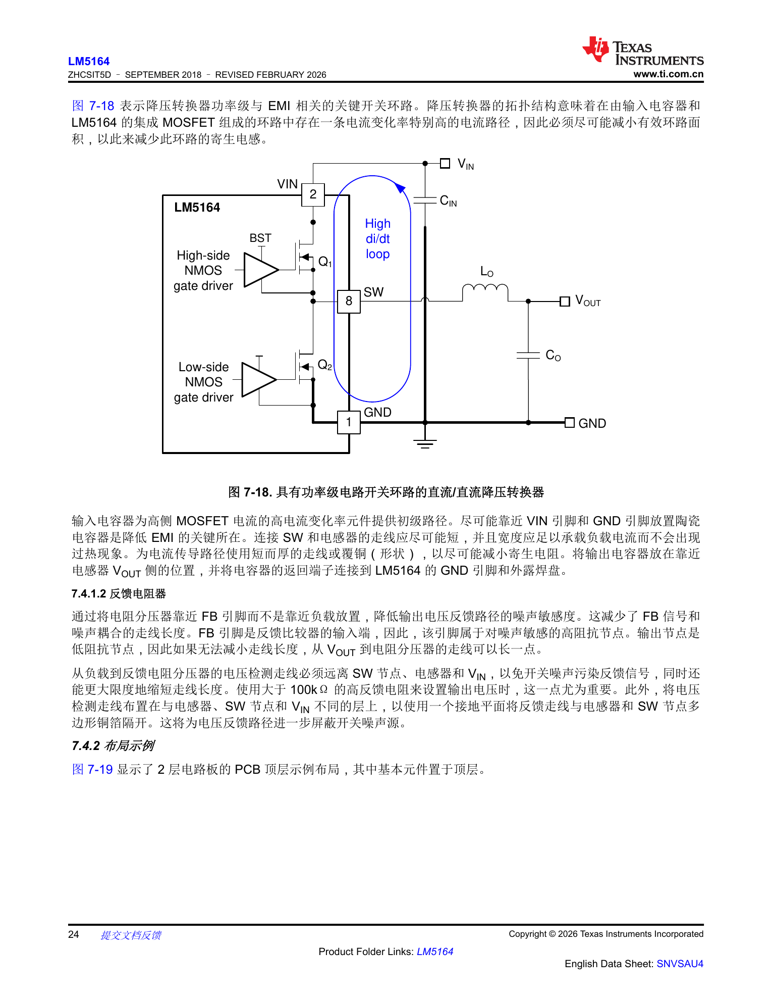

---

# 第三部分：PCB功率回路与制造实现

## Slide 30：四层板层叠与铜厚选择
- 当前计划四层全部2oz，并在嘉立创下单参数中确认
- 2oz提高平面载流和降低压降，但不等于所有窄颈和过孔自动满足18A
- 需要结合成品铜厚公差、孔铜厚度、阻抗和最小间距确认可制造性
- 盘中孔采用树脂塞孔＋电镀盖孔
- 角色：层叠与制造约束

## Slide 31：顶层大电流路径与局部瓶颈
- 按输入→保护→R12→$1N947→半桥→L6→R1→输出逐段检查铜宽
- 优先审查器件焊盘出口、铜皮窄颈、转角和连接器入口
- 功率焊盘采用直连，避免热焊盘十字连接限制电流
- 需要把每个局部瓶颈与对应过孔数量一起评估
- 角色：顶层功率布线
- Required images:
  - 顶层功率区域；严格输入素材

    

## Slide 32：半桥高di/dt开关环
- 最关键局部环路：$1N947→本地MLCC→上下桥MOS→GND→MLCC
- 环路面积和公共寄生电感直接影响SW过冲、振铃和EMI
- 本地电容位置、GND回流以及上下桥器件布局要作为一个整体审查
- 该环路不应依赖远端输入电解或长距离内层回流
- 角色：开关环路
- Required images:
  - 半桥开关区域；严格输入素材

    

## Slide 33：SW节点面积与跨层控制
- 底层大面积SW铜已删除
- 仍需检查SW到L6的铜皮面积、内层重叠、过孔和邻近敏感走线
- SW需要兼顾载流、散热和辐射噪声，不能简单追求面积最大
- SW/GND示波器焊盘应小且紧邻，避免长地线环路
- 角色：开关节点与EMI
- Required images:
  - 内层SW节点；严格输入素材

    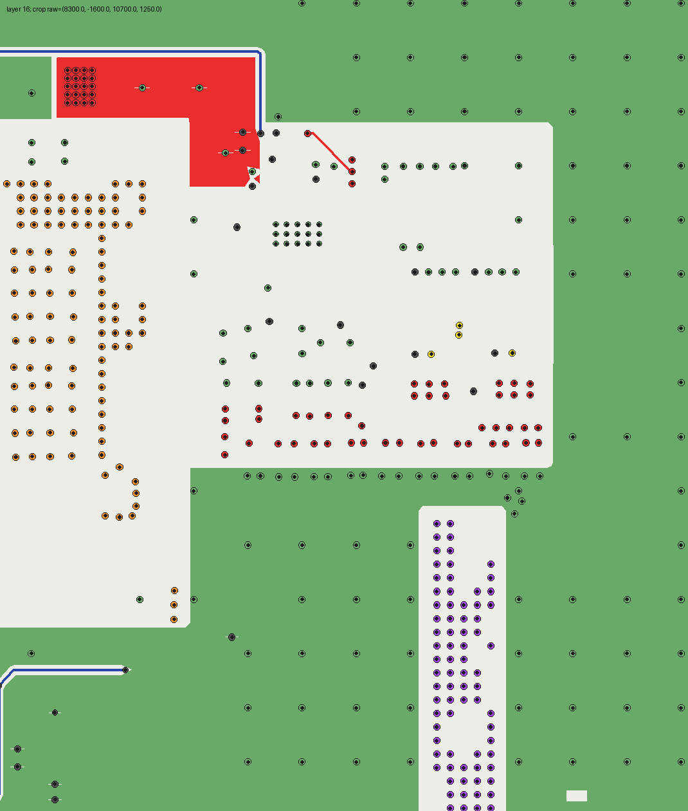

## Slide 34：R1/R12 Kelvin采样与敏感线布线
- 大电流铜皮与差分采样线应在采样电阻焊盘端头分开
- SENSE±和IVINP/N需要成对、短、远离SW和栅极
- 采样滤波电阻电容应靠近LT3763引脚
- 需要逐项确认R1、R12两组采样入口和回流参考点
- 角色：采样完整性
- Required images:
  - 顶层功率及采样区域；严格输入素材

    

## Slide 35：L3、底层与过孔阵列的电流分配
- $1N947在顶层与L3同网，并通过过孔阵列相连
- L3可参与主电源/地分流，底层主要承担回流与辅助跨层
- 当前功率过孔以0.6/0.3mm为主，能力取决于数量、孔铜和局部热拥挤
- 需要老师判断哪些网络应四层并联、哪些节点应限制跨层扩展
- 角色：层间电流与过孔
- Required images:
  - 内层主电流路径；严格输入素材

    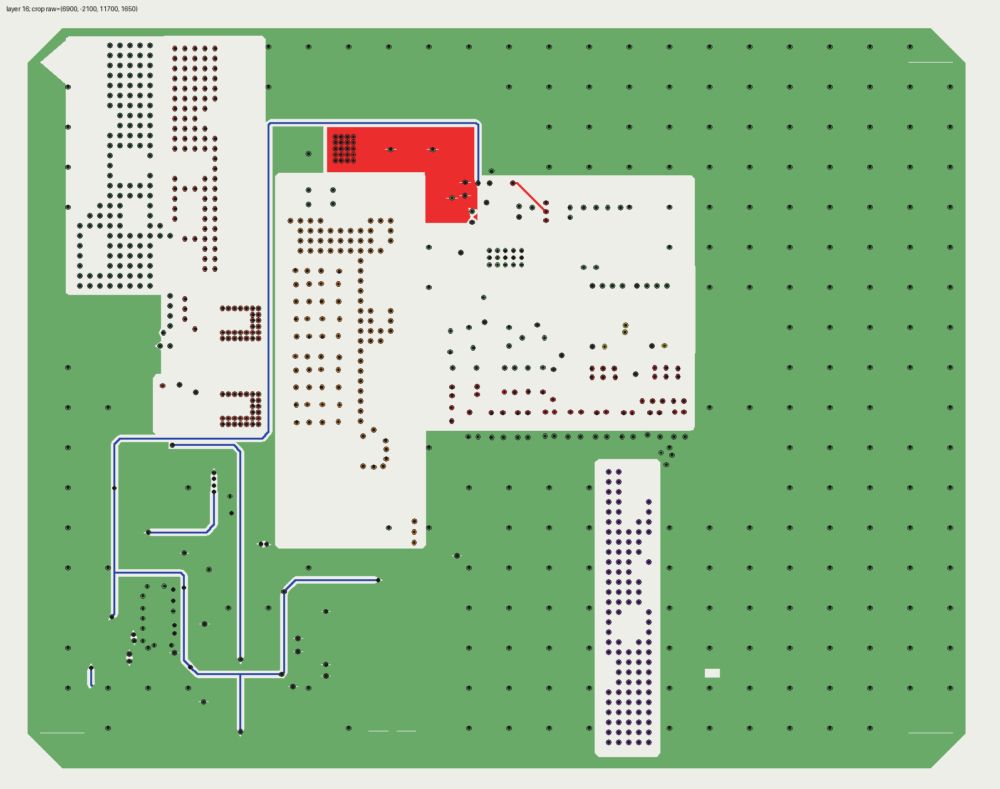
  - L3功率层；严格输入素材

    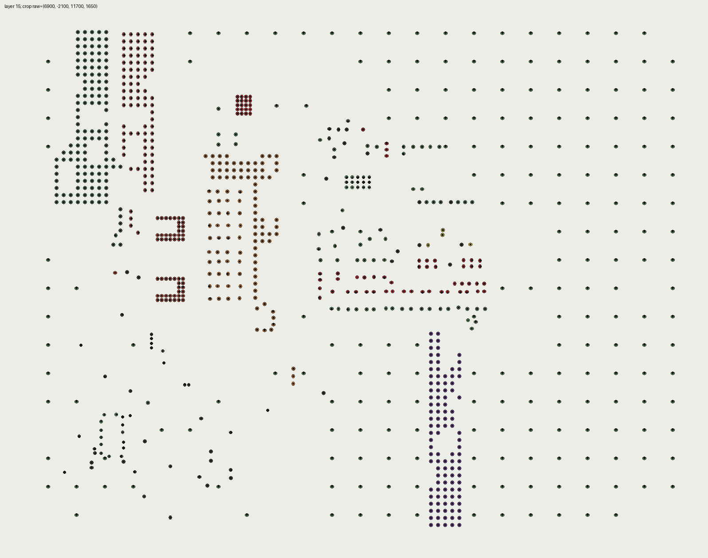
  - 底层回流；严格输入素材

    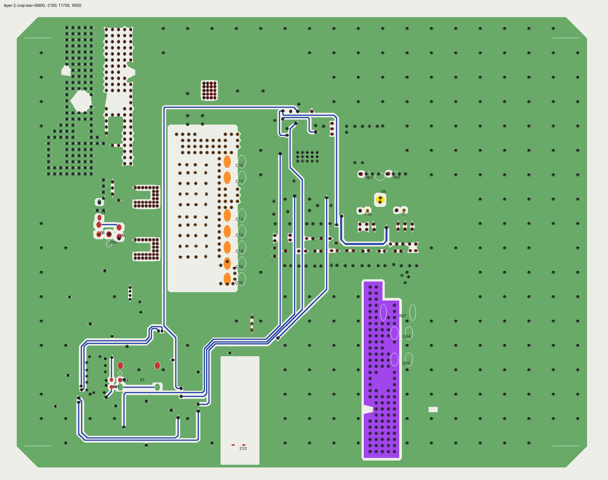

---

# 第四部分：尚未闭环的问题与老师意见

## Slide 36：当前已经确定并准备保留的设计
- 输出目标29V/18A，允许接近30V
- 四层全部2oz；盘中孔树脂塞孔＋电镀盖孔
- 本地增加两颗10µF/100V/1210输入MLCC
- 底层大面积SW铜已删除；功率焊盘采用直连
- 角色：已确定事项，避免重复讨论

## Slide 37：投板前仍需老师重点确认的问题
- LT3763补偿网络R4/C42是否适合作为首版起点
- 并联MOS栅极分叉、源极回流和动态均流是否可靠
- $1N947、GND与本地MLCC构成的高di/dt环路是否足够小
- R1/R12 Kelvin入口、L3分流和0.6/0.3mm过孔阵列是否合理
- 输入TVS、P-MOS、43V钳位和RC阻尼的动态配合是否安全
- 角色：老师审查重点

## Slide 38：首版样机的分级上电方案
- 第一步：不启用主Buck，单独验证12V、5V、3.3V、DAC、PWM和FAULT
- 第二步：限流电源、轻载、低电流，检查TG/BG、BOOST-SW和SW波形
- 第三步：1A→5A→10A→15A→18A逐级增加，并记录效率、纹波和温升
- 每一级提前规定停止条件：异常输入电流、驱动重叠、SW过冲、温升或保护振荡
- 角色：样机验证流程

## Slide 39：需要记录的关键波形与温度
- 波形：SW-GND、TG-SW、BG-GND、R1差分、R12差分、VOUT、FB、VC
- 热点：Q1/Q2/Q5/Q6、Q3/Q12、L6、R1、R12、输入RC、连接器和过孔阵列
- 工况：轻载、满载、输入阶跃、负载阶跃、启动、停机和故障
- 通过标准应由老师帮助设定，而不是只凭“能持续工作”判断
- 角色：测量计划

## Slide 40：希望老师给出的最终结论形式
- 必须修改：投板或继续升功率前必须调整的项目
- 必须验证：首版可保留，但要写明工况、仪器、停止条件和通过阈值
- 可以保留：计算、数据手册、PCB和风险均可接受，仅保留监测项
- 会后按结论修改epro2，并重新执行DRC、网表、BOM和功率回路复核
- 角色：交流收束 / 形成可执行结论

## 素材映射规则

- PCB截图均为严格输入素材：不得改变网络、器件、焊盘、过孔或相对位置，只能添加外围标题、箭头和标记。
- 数据手册截图均为严格输入素材：不得重绘曲线、改变坐标、数值、器件型号或英文原文。
- 引用数据手册时只提供必要的中文导读：通常1～2句，指出“看哪一段/哪幅图、它支持什么结论”；若页面中的公式和标注已经充分说明，就不再重复增加说明框，也不因此增加页数。
- 新版样张应优先选择“参数计算＋器件依据”的页面，例如Slide 13或Slide 24，而不是以问题页作为样张。
